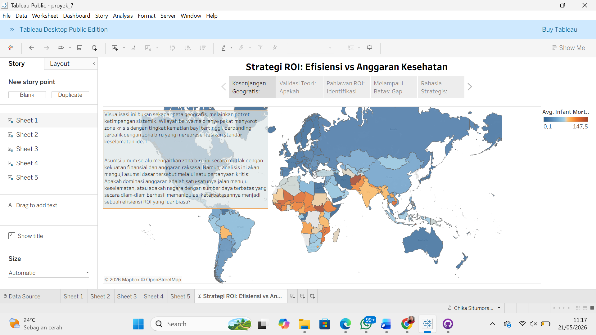
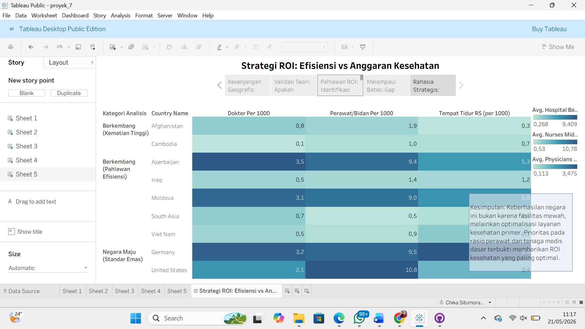
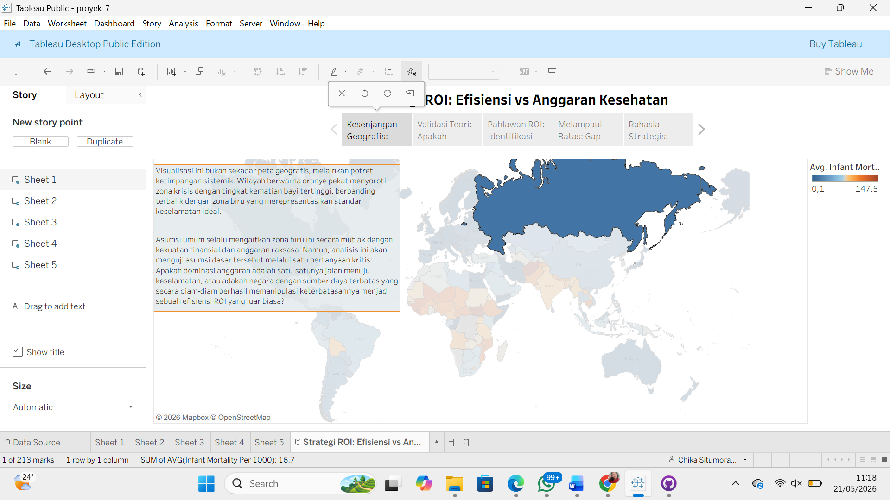
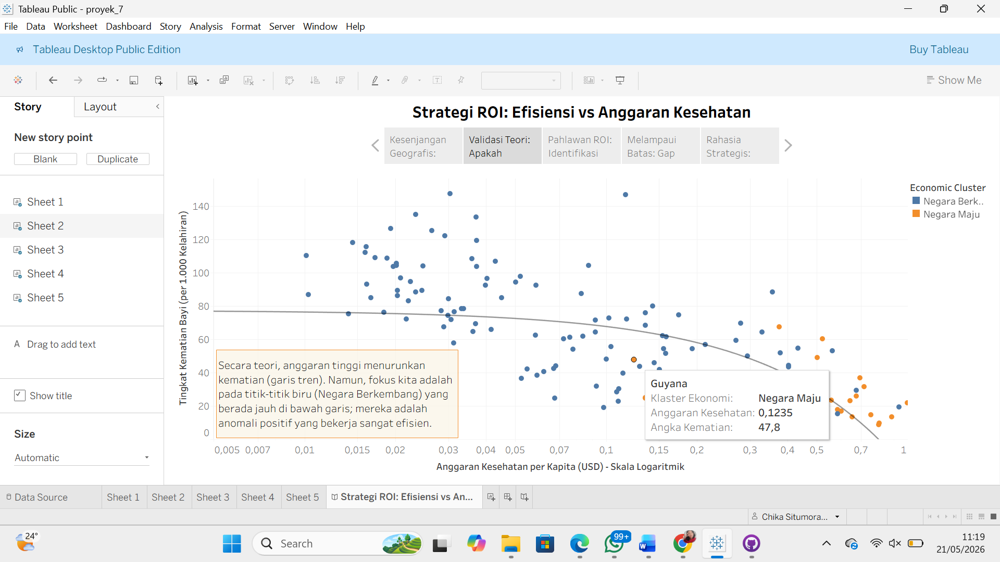

# Global Health ROI Analysis

## Project Overview

This project explores the relationship between healthcare expenditure and infant mortality rates across developed and developing countries.

Using Business Intelligence and Data Visualization techniques, the project investigates whether higher healthcare spending always leads to better health outcomes and identifies countries that achieve exceptional healthcare performance despite limited resources.

The analysis highlights "Healthcare ROI Champions"—countries that successfully reduce infant mortality beyond what would normally be expected based on their economic capacity.

---

## Objectives

* Analyze the relationship between healthcare spending and infant mortality.
* Identify countries with exceptional healthcare efficiency.
* Measure healthcare return on investment (ROI) using statistical analysis.
* Generate actionable insights for policymakers and healthcare stakeholders.

---

## Technologies Used

* Tableau
* Data Visualization
* Statistical Analysis
* Data Storytelling
* Business Intelligence

---

## Key Analysis Areas

### Global Infant Mortality Distribution

Visualizes the worldwide distribution of infant mortality rates and highlights regions facing major healthcare challenges.

### Healthcare Spending vs Infant Mortality

Analyzes the relationship between healthcare expenditure and infant mortality using trend analysis and clustering techniques.

### Healthcare ROI Champions

Identifies countries that outperform economic expectations by achieving significantly lower infant mortality rates.

### Expected vs Actual Performance

Compares predicted healthcare outcomes with actual results to quantify healthcare system efficiency.

### Healthcare System Architecture

Examines healthcare workforce and infrastructure factors associated with successful healthcare outcomes.

---

## Key Findings

* Healthcare spending generally correlates with lower infant mortality.
* Several developing countries outperform expectations despite limited healthcare budgets.
* Effective allocation of healthcare resources can be more important than overall spending levels.
* Strong primary healthcare services are associated with better healthcare outcomes.

---

## Dashboard Preview

### Global Infant Mortality Distribution

### Healthcare Spending vs Infant Mortality

### Healthcare ROI Champions

### Healthcare System Architecture

---

## Tableau Dashboard

View Interactive Dashboard:

https://public.tableau.com/shared/GT8SKMYFD?:display_count=n&:origin=viz_share_link

---

## Skills Demonstrated

* Data Analysis
* Business Intelligence
* Data Visualization
* Tableau Dashboard Development
* Data Storytelling
* Statistical Analysis
* Insight Generation

---

## Team Project

Developed collaboratively by students of Institut Teknologi Del as part of a Data Visualization and Business Intelligence project.
